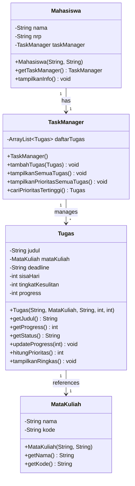
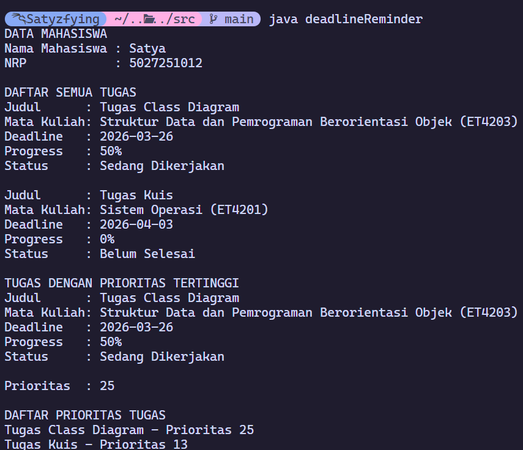

# Project 2 Deadline Reminder (OOP Java)

## 1. Deskripsi Kasus
Kasus yang saya ambil adalah kasus deadline yang sering dialami mahasiswa

Program ini membantu:
- mencatat data tugas,
- menampilkan daftar tugas,
- menghitung prioritas secara sederhana,
- menentukan tugas dengan prioritas tertinggi.

## 2. Class Diagram (Mermaid)


## 3. Kode Program Java
File implementasi utama ada di:
- [`src/deadlineReminder.java`](src/deadlineReminder.java)

Inti fungsi program dibagi jadi beberapa bagian:
- `Mahasiswa`
  Menyimpan identitas mahasiswa (`nama`, `nrp`) dan memiliki `TaskManager` untuk mengelola semua tugas.
- `MataKuliah`
  Menyimpan data mata kuliah (`nama`, `kode`) yang akan masukkan ke setiap objek `Tugas`.
- `Tugas`
  Class utama untuk data tugas. Di dalamnya ada:
  - `updateProgress(int progressBaru)`: validasi dan update progress tugas (0-100 persen).
  - `getStatus()`: mengembalikan status otomatis dari progress (`Belum Selesai`, `Sedang Dikerjakan`, `Selesai`).
  - `hitungPrioritas()`: menghitung skor prioritas berdasarkan urgensi deadline, tingkat kesulitan, dan sisa progress.
  - `tampilkanRingkas()`: menampilkan data tugas ke terminal.
- `TaskManager`
  Mengelola list tugas (`ArrayList<Tugas>`), dengan fungsi:
  - `tambahTugas(Tugas tugas)`: menambahkan tugas ke daftar.
  - `tampilkanSemuaTugas()`: menampilkan seluruh tugas.
  - `tampilkanPrioritasSemuaTugas()`: menampilkan judul tugas dan nilai prioritasnya saja.
  - `cariPrioritasTertinggi()`: mencari tugas dengan skor prioritas paling tinggi.
- `main()`
  Membuat objek contoh, mengisi data tugas, update progress, lalu menampilkan hasil output.

Berikut adalah logika perhitungan prioritas yang saya gunakan:
```java
public int hitungPrioritas() {
    int urgensi = Math.max(0, 10 - sisaHari);
    int sisaProgress = (100 - progress) / 10;
    return urgensi + tingkatKesulitan + sisaProgress;
}
```

## 4. Screenshot Output

Preview screenshot:


Contoh output teks saat ini (tersimpan di `docs/output.txt`):
```text
DATA MAHASISWA
Nama Mahasiswa : Satya
NRP            : 5027251012

DAFTAR SEMUA TUGAS
Judul      : Tugas Class Diagram
Mata Kuliah: Struktur Data dan Pemrograman Berorientasi Objek (ET4203)
Deadline   : 2026-03-26
Progress   : 50%
Status     : Sedang Dikerjakan

Judul      : Tugas Kuis
Mata Kuliah: Sistem Operasi (ET4201)
Deadline   : 2026-04-03
Progress   : 0%
Status     : Belum Selesai

TUGAS DENGAN PRIORITAS TERTINGGI
Judul      : Tugas Class Diagram
Mata Kuliah: Struktur Data dan Pemrograman Berorientasi Objek (ET4203)
Deadline   : 2026-03-26
Progress   : 50%
Status     : Sedang Dikerjakan

Prioritas  : 25

DAFTAR PRIORITAS TUGAS
Tugas Class Diagram - Prioritas 25
Tugas Kuis - Prioritas 13
```

## 5. Prinsip OOP yang Diterapkan
- **Encapsulation**: data disimpan sebagai `private` field di tiap class dan diakses lewat method.
- **Abstraction**: detail perhitungan prioritas disembunyikan di method `hitungPrioritas()`.

## 6. Keunikan Program
- Metode penghitungan prioritas yang menggabungkan urgensi, tingkat kesulitan, dan progress. Metode ini bersifat subjektif karena prinsip prioritas setiap orang bisa saja berbeda-beda.

## 7. Cara Menjalankan
```bash
javac -d bin src/deadlineReminder.java
java -cp bin deadlineReminder
```
